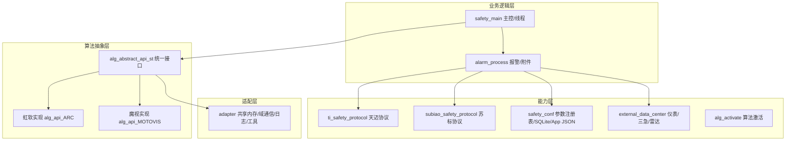
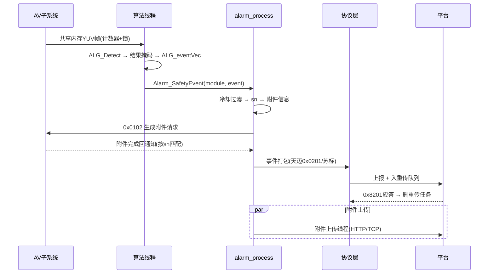
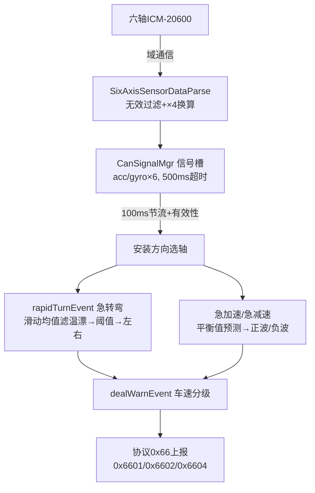

# 16 · 面试必画图(4张,现场手绘版 + Mermaid版)

> 面试官明确把"能画架构图"当加分项——**纸上画得出 = 真的懂**。
> 每张图给两种形式:① 纯文本版(面试现场白板/共享屏直接画)② Mermaid 源码(可转PNG放进简历/作品集)。
> 练习:不看本页,在纸上画出 4 张图,每张 <2 分钟。

---

## 图1:主动安全模块架构分层图(必画,开场讲架构时用)

### 文本版(现场画)

```
┌────────────────────────────────────────────────┐
│ 业务逻辑层                                     │
│   safety_main(主控/线程/对外接口)               │
│   alarm_process(报警处理/附件管理)              │
├────────────────────────────────────────────────┤
│ 能力层                                         │
│   协议:ti_safety_protocol(天迈)/ subiao(苏标)  │
│   参数:safety_conf(注册表/SQLite/App JSON)     │
│   外部数据:external_data_center(仪表/三急/雷达) │
│   激活:alg_activate                           │
├────────────────────────────────────────────────┤
│ 算法抽象层 alg_abstract_api_st                 │
│   ├── 虹软实现 alg_api_ARC.cpp                 │
│   └── 魔视实现 alg_api_MOTOVIS.cpp  (宏切换)   │
├────────────────────────────────────────────────┤
│ 适配层 adapter(共享内存YUV/域通信/日志/工具)   │
└────────────────────────────────────────────────┘
三个解耦:算法厂商无关 · 平台协议隔离 · 设备可移植
```

### Mermaid 版([fig1_architecture.mmd](assets/mermaid/fig1_architecture.mmd))



---

## 图2:一条报警的完整旅程(必画,讲业务闭环时用)

### 文本版(现场画)

```
AV子系统 ──共享内存YUV帧──▶ 算法线程 Task_BlockedFeedData
    │ 1.取帧  2.更新车速  3.ALG_Detect
    ▼
算法结果(掩码) ──ALG_eventVec──▶ 通用事件
    ▼
Alarm_SafetyEvent
    │ 冷却过滤 → 生成sn → 组附件信息
    ├─▶ 通知AV抓拍/录像(0x0102域通信) ──▶ 附件上传线程(HTTP/TCP)
    │                                     └─▶ 失败600s冷却/退出持久化
    └─▶ 协议上报
         ├─ 天迈:0x0201组包(89B头+子事件) ──▶ 平台
         └─ 苏标:SuBiao_eventPack ──▶ 调度转发平台
    ▼
平台应答(0x8201) ──▶ 从重传队列删除
    ▼
    附件回填(sn匹配文件列表) → 上传 → 完成删除任务
```

### Mermaid 版([fig2_alarm_flow.mmd](assets/mermaid/fig2_alarm_flow.mmd))



---

## 图3:三急数据链路图(你的主战场,讲三急必画)

### 文本版(现场画)

```
六轴传感器 ICM-20600(3轴加速度+3轴陀螺仪, 单位4mg, 0x8000无效)
    │ 调度(SCH)域通信转发
    ▼
SixAxisSensorDataParse
    │ 无效值过滤 + ×4换算mg
    ▼
CanSignalMgr 信号槽(acc/gyro × 6, 500ms超时)
    │ 100ms节流 + 有效性门控
    ▼
getDirForInstallingEquipment(安装方向→选轴)
    │
    ├─▶ rapidTurnEvent(急转弯:陀螺仪Z轴)
    │      滑动均值滤温漂 → |角速度|≥阈值 → 左/右 → 间隔过滤
    ├─▶ dealSharpSpeedChanged(急加减:线性加速度)
    │      平衡值预测 → 正波加速/负波减速 → 抖动/事件阈值
    ▼
dealWarnEvent(车速分级 → 1/2/3级动作)
    ▼
报警 → 协议0x66上报(急加速0x6601/急减速0x6602/急转弯0x6604)
```

### Mermaid 版([fig3_three_urgent.mmd](assets/mermaid/fig3_three_urgent.mmd))



---

## 图4:CAN 信号级框架图(你的重构,讲优化必画)

### 文本版(现场画)

```
收包线程(生产者)                         业务线程(消费者)
┌─────────────┐  解析只写槽   ┌──────────────┐  按需读取   ┌─────────┐
│ CAN报文/数据项│ ──────────▶ │ CanSignalMgr │ ─────────▶ │ 算法/三急│
│ 仪表/六轴/雷达│   逐项update │ 信号注册表+槽 │  getWithTime│ /倒车   │
└─────────────┘              │ O(1)索引      │  带有效性   └─────────┘
                             │ 超时500ms     │
                             │ version计数   │
                             │ 批量更新单锁   │
                             └──────┬───────┘
                                    │ 1s周期检查(可选)
                                    ▼
                              可选: ExtDataTimeout线程
                              (超时→置无效→回调;
                               惰性判断已保正确,此线程按需启用,见方案B)

设计: 解析/业务解耦 · 惰性超时+周期双保险 · 高频零动态内存
迁移: 宇通1700帧/s → 攒批/周期发布/分级超时/优先级
```

### Mermaid 版([fig4_can_signal.mmd](assets/mermaid/fig4_can_signal.mmd))

```mermaid
flowchart LR
    subgraph Producer[收包线程]
        RX[CAN报文<br/>仪表/六轴/雷达]
    end
    subgraph Core[CanSignalMgr]
        REG[信号注册表]
        SLOT[信号槽 O(1)索引]
        TO[超时监控 500ms]
        VER[version变化检测]
        BATCH[批量更新 单锁]
    end
    subgraph Consumer[业务线程]
        ALG[算法/三急/倒车]
    end
    subgraph Monitor[超时监控线程 1s]
        CHK[checkTimeout<br/>置无效+回调]
    end
    RX -->|逐项update| SLOT
    REG --> SLOT
    SLOT -->|getWithTime 带有效性| ALG
    TO --> SLOT
    VER --> SLOT
    BATCH --> SLOT
    SLOT --> CHK
```

---

## 使用建议

1. **练习**:先默画文本版(白纸/白板),再对照校正;每张图练到 <2 分钟画完
2. **现场**:面试讲架构画图1,讲报警画图2,讲三急画图3,讲重构画图4
3. **作品集**:Mermaid 源码可用 mermaid.live 或 typora 转 PNG,放进简历附件/作品集
4. **进阶**:面试官让你"画一下你们系统的数据流"——直接用图2;让你"讲你做的模块"——图3;让你"讲你的优化"——图4
